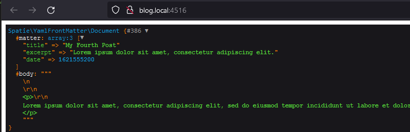

[//]: Закомментировано
[//]: 
[//]: 



http://blog.local:4516/

## Пример работы YamlFrontMatter  

После установки $ composer require spatie/yaml-front-matter

весь код работает на четырех строчках в web.php  
```
use Spatie\YamlFrontMatter\YamlFrontMatter;
...
Route::get('/', function () {
    $document = YamlFrontMatter::parseFile (resource_path('posts/my-fourth-post.html'));
    dd($document);
```


