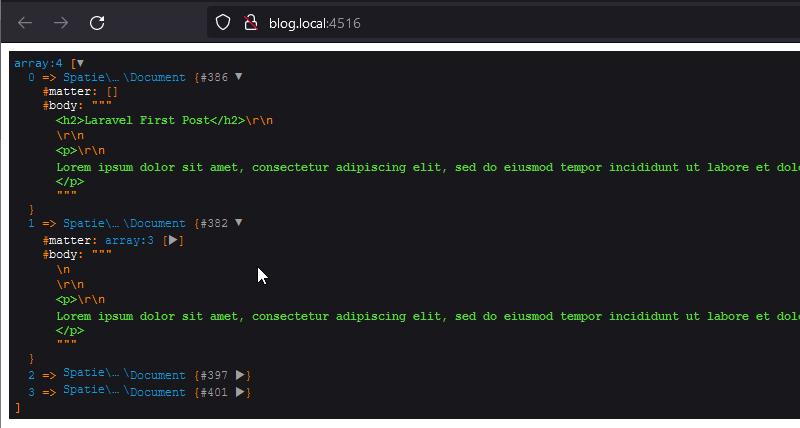

http://blog.local:4516/

## Пример работы YamlFrontMatter  

Вся работа идёт в web.php до  dd($documents);

Загружается и отображается контент всех файлов из указанной директории с помощью парсера YamlFrontMatter

