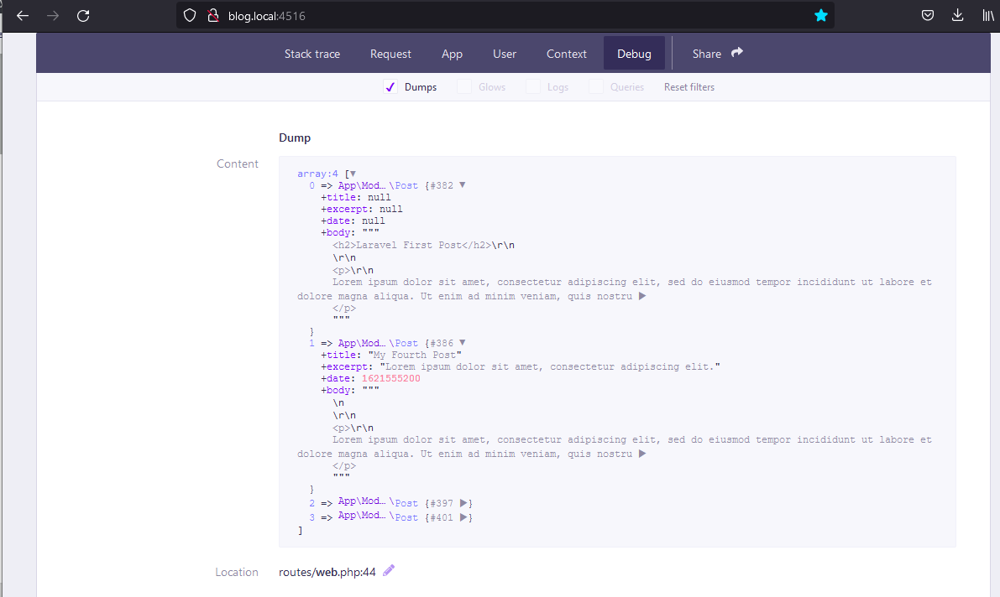

http://blog.local:4516/

## Пример работы YamlFrontMatter

Вся работа идёт в web.php до  ddd();

Теперь  
благодаря конструктору в Post, повторяющему аналогичные значения из YamlFrontMatter,  
получаем объекты Post вместо объектов Spatie\YamlFrontMatter\Document.

