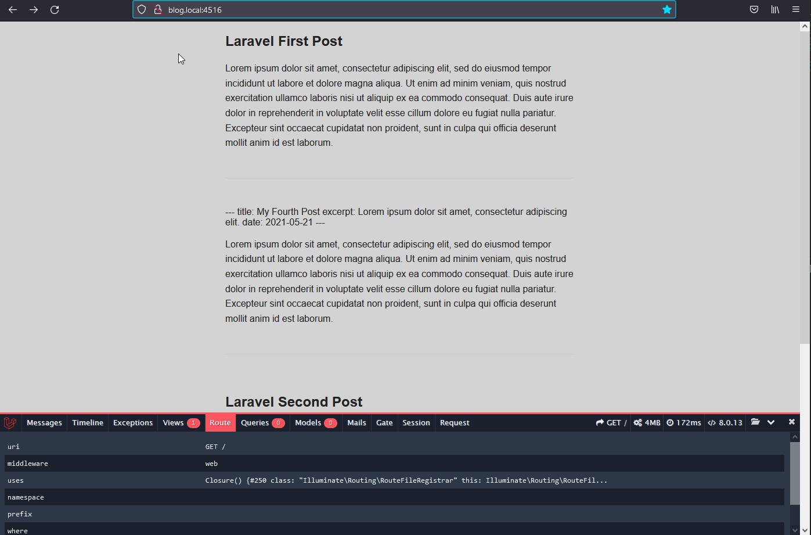

[//]: Закомментировано
[//]: 
[//]: 

http://blog.local:4516/

1. В web.php отрабатывается обращение к главной странице  
с помощью Route::get('/'...  
к-рый обращается к модели POST::all.  
Тут POST своим методом all собирает контент всех файлов из указанной директории.  

2. Тут же в web.php в Route::get('/'...    
вызывается вью resources\views\posts.blade.php,  
куда в качестве переменной передается полученный от POST массив.

3. На экран вызывается posts.blade.php. Внутри которой идет обработка переданной переменной $myposts.

